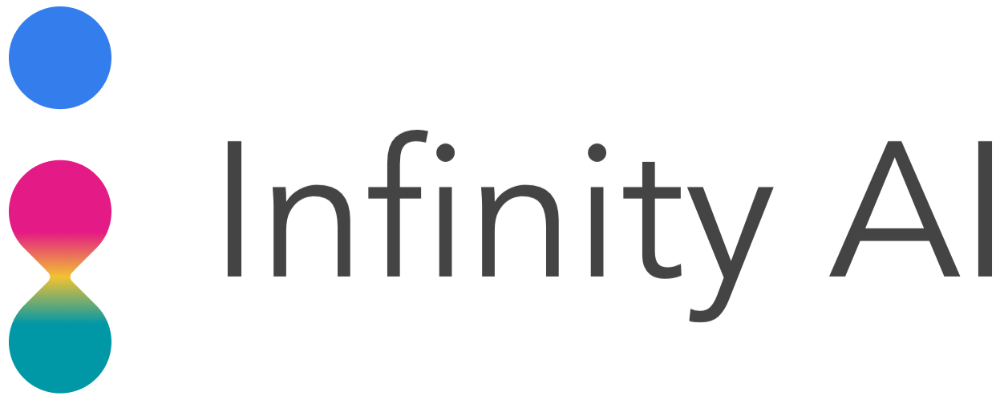

  

# Spills API

The Infinity Spills API generates photorealistic videos of spills in various retail, industrial, and workplace environments. The API allows users to generate videos of spills with various configurations like shape, size, and color. Our pixel-perfect labels include standard object detection and localization annotations for the spill and floor, including segmentation masks and bounding boxes.

# Spills Client Library

This `spills` client library adds higher-level functionality and abstractions on top of the base RESTful Infinity API. This includes ergonomics for interacting with the cloud API and data science/ML tools. The `spills` library contains the following submodules:

- [api.py](./api.py): This module contains abstractions and ergonomic functionality built on top of [common.api.py](../common/api.py) specific for the Spills API. Some key components include functions to randomly sample input parameters (while specifying any subset exactly), validation of input parameters against constraints, functions to support a preview/full video dichotomy, and functions to support parametric sweeping seeded on a previous job.
- [vis.py](./vis.py): This module defines visualization and summarization functions specific to the Spills API.

# Spills Tutorial Notebooks

We refer users to the [Infinity API Tutorials](https://github.com/toinfinityai/infinity-tutorials/tree/main/spills) repo for extensive notebook examples that make use of this `spills` client library.
